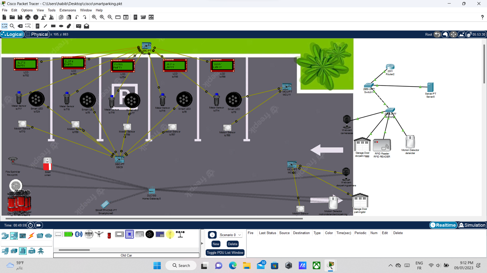
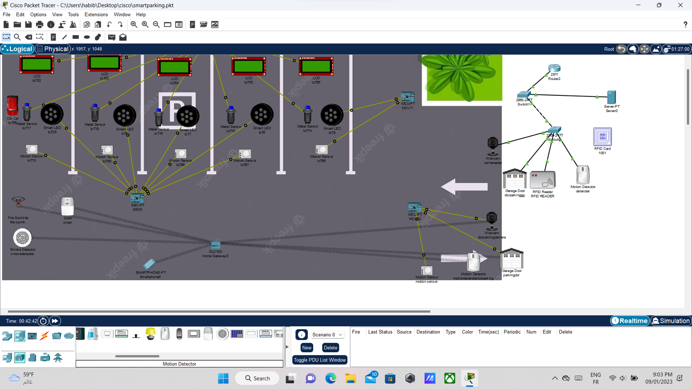

# Smart-Parking

# Système de Stationnement Intelligent




## Aperçu

Ce référentiel contient la mise en œuvre d'un Système de Stationnement Intelligent utilisant les technologies IoT. Le système est conçu pour contrôler de manière intelligente l'infrastructure de stationnement, comprenant des portes, des lumières, des détecteurs de gaz et de mouvement, des alarmes, des webcams et des LED intelligentes. L'accès à la zone de stationnement est géré via des cartes RFID, assurant une autorisation sécurisée.

## Environnement de Simulation

Le projet est simulé et modélisé à l'aide de Cisco Packet Tracer, offrant une plateforme complète pour la conception et le test de réseaux complexes.

## Composants Utilisés

- **Microcontrôleur :** Unité de contrôle centralisée responsable de la coordination des différents composants et de la gestion des entrées/sorties.
- **Cartes RFID :** Utilisées pour l'autorisation d'accès, chaque utilisateur autorisé recevant une carte RFID unique.
- **Serveur et Switch :** Le serveur stocke les données d'accès autorisées, tandis que le switch facilite la communication entre les composants du système.
- **Passerelle :** Permet la communication entre le réseau local et Internet pour la surveillance à distance.
- **Carte MCU-PT :** Connecte et contrôle divers dispositifs du système.
- **Détecteurs de Gaz et de Mouvement :** Capteurs pour détecter le gaz et le mouvement dans la zone de stationnement, assurant la sécurité.
- **Alarme :** Activée en cas de situations anormales pour une réponse rapide.
- **Webcams :** Utilisées pour la surveillance visuelle de la zone de stationnement et l'enregistrement d'incidents.
- **LEDs Intelligentes :** Indiquent l'état des places de stationnement (libre/occupé) et guident les utilisateurs.

## Mise en Œuvre

1. **Configuration du Microcontrôleur :** Programmez le microcontrôleur pour gérer les entrées/sorties et coordonner les actions des autres composants.
2. **Intégration des Cartes RFID :** Configurez les cartes RFID pour l'autorisation d'accès, en les liant au serveur pour la gestion des données d'accès.
3. **Configuration du Serveur et du Switch :** Mettez en place le serveur pour stocker les informations d'accès et configurez le switch pour faciliter la communication entre les composants.
4. **Intégration des Détecteurs et de l'Alarme :** Installez et configurez les détecteurs de gaz et de mouvement, ainsi que l'alarme pour assurer la sécurité de la zone de stationnement.
5. **Installation des Webcams et des LEDs Intelligentes :** Positionnez les webcams pour la surveillance visuelle et configurez les LEDs intelligentes pour indiquer l'état des places de stationnement.
6. **Tests et Débogage :** Validez le bon fonctionnement du système, en détectant et corrigeant les éventuels problèmes.

## Pour Commencer

Pour commencer avec le Système de Stationnement Intelligent, suivez ces étapes :

1. Clonez le dépôt sur votre machine locale.
   ```bash
   git clone https://github.com/votre-nom/systeme-stationnement-intelligent.git
   ```
